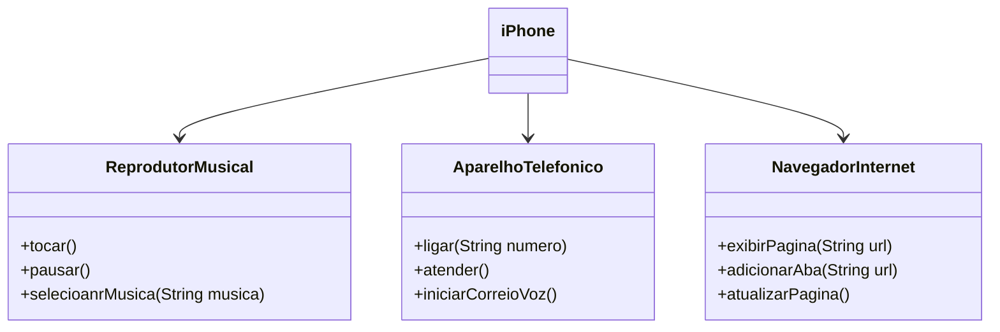

# POO DESAFIO

## Modelagem e Diagramação de um Componente iPhone

Neste desafio, mergulhamos na arquitetura de um dos dispositivos mais icônicos da tecnologia: o iPhone. Nosso objetivo foi modelar e diagramar a representação UML do seu componente central, abordando suas funcionalidades-chave como Reprodutor Musical, Aparelho Telefônico e Navegador na Internet.

**Contexto e Abordagem:** 
O ponto de partida para este desafio foi o vídeo de lançamento do iPhone de 2007, que serviu como base para identificar as funcionalidades e interações do aparelho. A partir daí, o processo envolveu duas etapas principais:

**Diagramação UML:** 
Utilizando uma ferramenta UML de preferência (eu usei o Lucidchart, mas outras como o Draw.io ou PlantUML também são ótimas opções), elaborei os diagramas de classes e interfaces. O foco foi em representar as relações e responsabilidades de cada componente.

**Implementação:** Com os diagramas definidos, parti para a implementação das classes e interfaces em arquivos Java. Essa etapa solidificou a compreensão do modelo, transformando a teoria em código funcional.

Ao longo do desafio, explorei conceitos como:

**Interfaces:** Para definir os contratos das funcionalidades (por exemplo, ReprodutorMusical, AparelhoTelefonico, NavegadorInternet).

**Classes:** Para implementar essas interfaces e representar o "iPhone" em si, orquestrando as diferentes funcionalidades.

**Encapsulamento: ** Garantindo que cada parte do sistema tenha suas responsabilidades bem definidas.

**Este desafio foi uma excelente oportunidade para aprimorar minhas habilidades em modelagem de software e traduzir requisitos de negócio (apresentados no vídeo de lançamento) em um design de código robusto e claro.**
